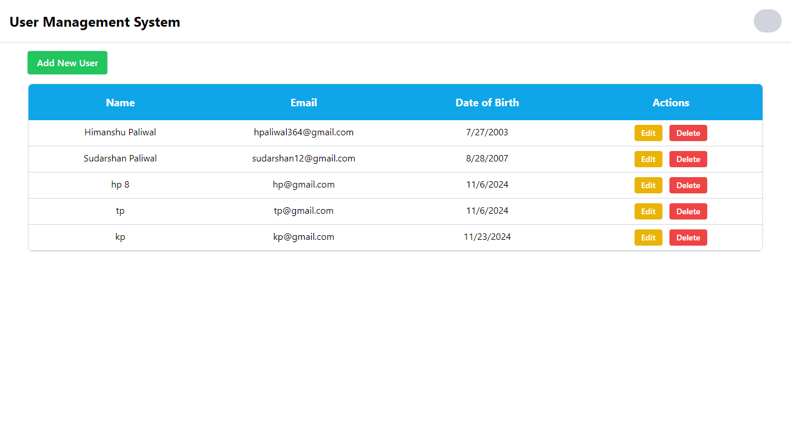
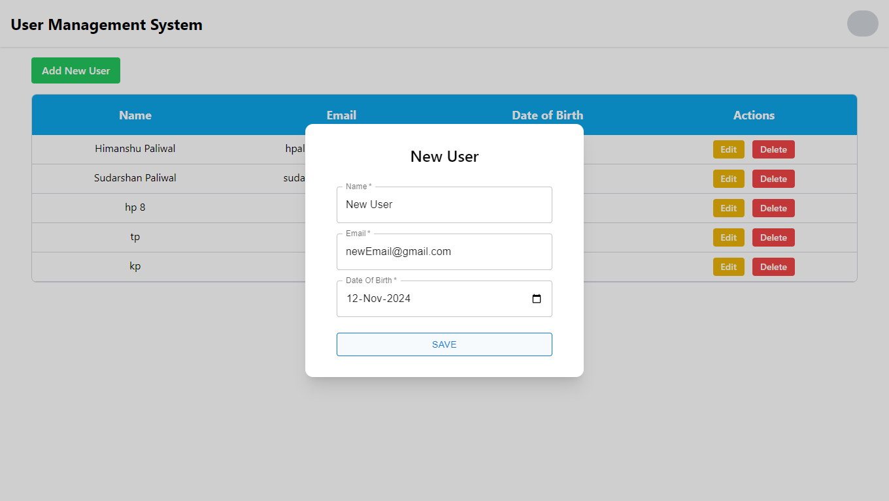
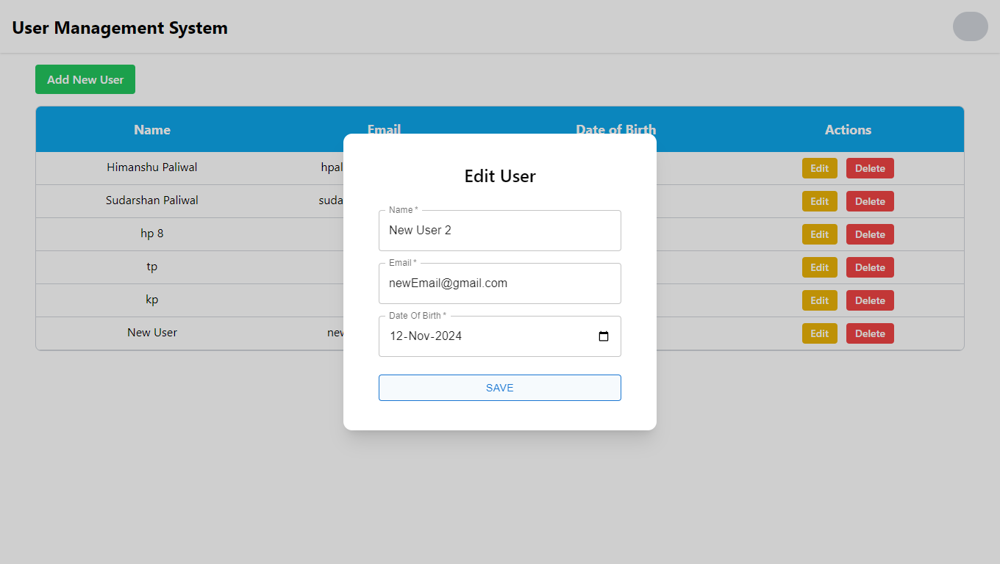
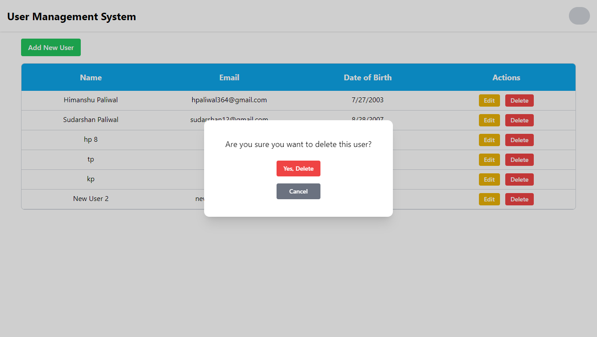
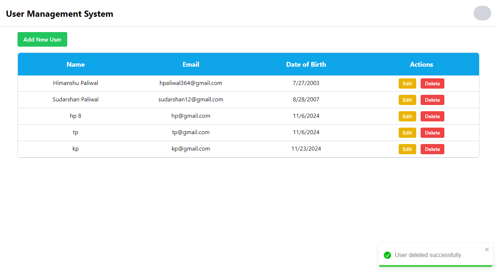
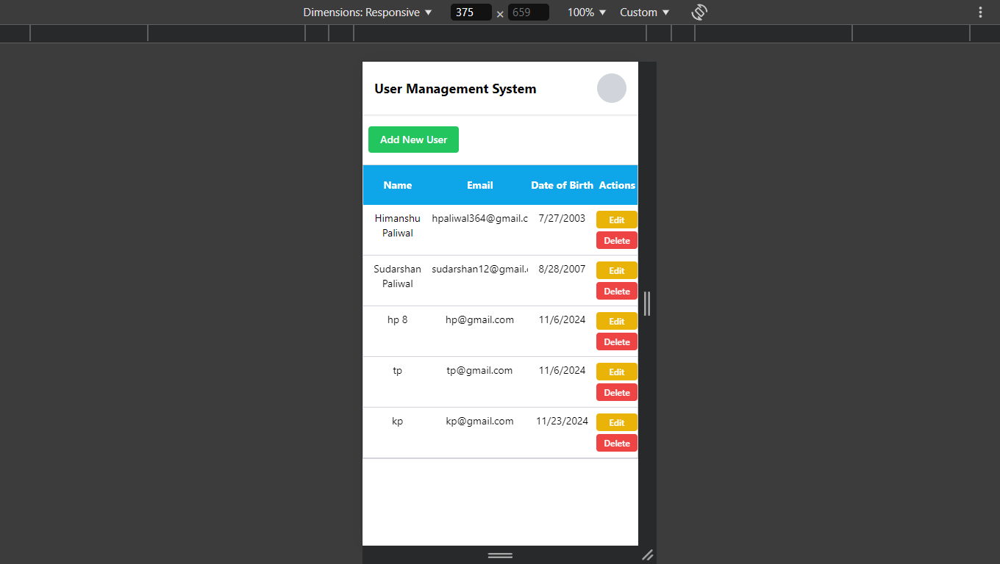
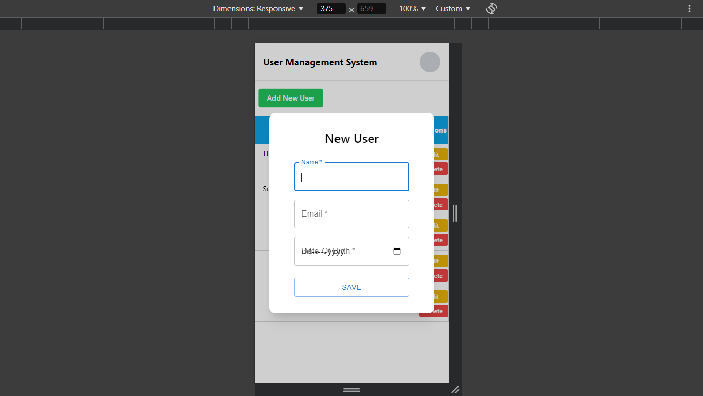

# User Management System

## Frontend

### Frontend Overview
The frontend is designed with an emphasis on usability and visual appeal. Users can view, add, update, and delete users through a simple and responsive interface.

### Frontend Features
- **CRUD Operations**: UI to perform Create, Read, Update, and Delete actions.
- **Data Validation**: Ensures correct input for all fields.
- **Modern Design**: Follows best practices in UI/UX design for a clean and efficient user experience.
- **Responsive Interface**: Adjusts to different screen sizes for optimal viewing.

### Frontend Technologies Used
- **React**: For building the frontend.
- **Tailwind css**: For styling.
- **Axios**: For HTTP requests to the backend.
- **Zustand**: For state management.
- **React Toastify**: For notification feedback.
- **Material UI**: For styling and components.

### Frontend Screenshots
#### Desktop

#### Mobile

---

## Backend

### Backend Overview
The backend is developed using **Node.js** and **Express**, providing RESTful API endpoints for CRUD operations. It manages data for adding users, updating user data, deletion of users and fetching all users.

### Backend Features
- **CRUD Endpoints**: Endpoints to create, read, update, and delete user data.
- **Error Handling**: Handles errors gracefully, ensuring proper feedback.

### Backend Technologies Used
- **Node.js**: JavaScript runtime for server-side code.
- **Express**: Framework for building the backend.
- **MongoDB**: NoSQL database to store user data.
- **Mongoose**: For data modeling.

---

## Project Links
- [Live Demo](https://user-management-system-frontend.netlify.app/)
- [API](https://user-management-system-22ix.onrender.com/api/v1/users/)

---
